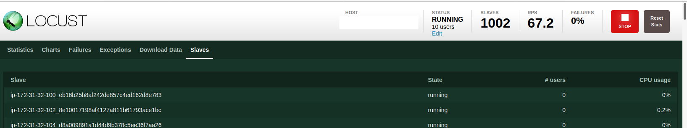

# Locust based Stress Testing

Locust is a distributed stress testing system. The system itself and the test specification are programmed in Python and can then be run on N hosts (a swarm) that all query a central server for work assignments. This installation tested about 1000 nodes.




The installation was tested in terms of performance and did about 100,000 RPS with 400 slaves and 4000 users, using a 0.01 interval in the spec file. Load on the slaves was uneven ranging from 100% to 30%.


The main server has a web interface which is used to control the swarm and show statistics. 
By default the web interface is not secured. This installation front ends it with an nginx server for that purpose and forces SSL and requests a password.

The locust package itself is hosted on PyPi.

This installation uses puppet to setup the locust central server and swarm. There are optimizations for AWS for quicker installation of the swarm using AWS specific AMI images and the AWS API.

Puppet controls the stress test spec file and restarts locust when a change is detected, allowing for dynamic changes to the spec file.


       +--------------+
       |              |
    +--+ puppetmaster |
    |  |              |
    |  +--------------+
    |
    |  +--------------+
    |  |              |
    +--+ locustmaster |
    |  |              |
    |  +--------------+    orchestration/
    |         |            statistics
    |         +-------------------------------+
    |         |             |                 |
    |  +-----------+  +-----------+     +-----------+
    |  |           |  |           |     |           |
    |  |  node_1   |  |  node_2   | ... | node_1000 |
    |  |           |  |           |     |           |
    |  +-----------+  +-----------+     +-----------+
    |       |               |                 |
    +-----------------------------------------+
             configuration


Here is an example stress test file, which gets an index.html page with a random OK parameter appended. We also specify a User-Agent and a fixed name which is used to group statistics, which useful when the URL has a dynamic component that is different every call.

The code gets an URL, then waits 0.1 seconds and automatically loops back and executes again:

    from locust import HttpLocust, TaskSet, between
    import random
    
    def index(l):
      r = random.random()
      indexstr = "/index.html?ok=" + str(r)
      l.client.get(indexstr,headers={"UserAgent":"locust",name="/index.html?ok=[random]"})
    
    class UserBehavior(TaskSet):
      tasks = {index: 1}
    
    class WebsiteUser(HttpLocust):
      task_set = UserBehavior
      wait_time = between(0.1,0.1)


## Installation using Vagrant and Puppet:

There are 3 steps in the installation:

1. Setup the puppetmaster server
2. Setup the locustmaster server
3. Setup the locust nodes 

The Vagrantfile contains the logic for each step, after each run a DNS name or IP addresses need to be adjusted.

Puppet classes used:

##### locustserver
  - server type startup files (--master and --webhost)
  - installs the initial test spec (locustfile.py)
  - installs nginx, certificates and a password file

##### locustclient

  - client type startup files (--slave and --master-host)
  - installs the initial test spec (locustfile.py)

##### locust

  - installs the locust package, creates a locust user 

  - common to both locustclient and locustserver

    

Files: 

- locustserver/init.pp
  - manifests/init.pp
  - files/locustfile.py
  - files/locustserver.service
  - files/dhparam.pem
  - files/nginx.crt
  - files/nginx.key
  - files/htpasswd
  - files/default
  
- locustclient

  - manifests/init.pp
  - files/locustfile.py
- files/locustclient.service
  
- locust

  - manifests/init.pp

    


Test on AWS
-----------

###### Prep: 

- Need control over a domain for the DNS names involved in the setup 

  - examples use: clouddomain.expert

- update the hostname used to connect to puppet (puppetmaster.clouddomain.expert) in the Vagrantfile in the PMNAME variable

- adjust site.pp to include the right patterns for the locustmaster and the locust nodes

- update the hostname used to connect to (locustmaster.clouddomain.expert) in locust/files/locust.service

- Generate a certificate for locustmaster.coulddomain.expert and store the files in locustserver/files/nginx.crt and locustserver/files/nginx.key. The Common Name field needs to be: locustmaster.clouddomain.expert

  - ```
    openssl req newkey rsa:2048 -nodes -keyout nginx.key x509 -days 365 -out nginx.crt
    ```

###### AWS Setup

- create AWS access keys for API access in IAM, Users, Security Credentials
- create a security group called "ssh" TCP port 22
- create a security group called "server" TCP ports 22, 443, 8140 and 5557

###### vagrant up puppetmaster

- get the IP of VM created: 
  - aws ec2 describe-instances --filters Name=instance-state-name,Values=running --output table | egrep 'InstanceType|PublicIpAddress'
  - Web GUI
- update puppetmaster.clouddomain.expert IP address in DNS - it is needed for the next step

###### vagrant up locustmaster

- get the IP of the VM created: 
  - aws ec2 describe-instances --filters Name=instance-state-name,Values=running --output table | egrep 'InstanceType|PublicIpAddress'
  - update locustmaster.clouddomain.expert with the IP. This DNS name is used by the locust swarm to connect to, get work and update statistics
  - wait for 10 minutes until a puppet run has happened (runs every 5 minutes)
  - try https://locustmaster.clouddomain.expert which should forward to the Locust web GUI.
    - accept the self-signed cert

###### vagrant up

- creates the initial nodes (just 1)
- as an optimization uses the base Ubuntu 18.04 image with puppet-agent and locust preinstalled
- One can increase the number of nodes incrementally, but vagrant creates nodes in parallel and can easily overwhelm the AWS API and get in a throttling mode (happened with 64 nodes). 
  - drive_vagrant.sh is a shells script that can be sued can be used to incrementally add nodes
  - throughput: 1 node per minute +/- with preinstalled image
- can be run in parallel on multiple AWS accounts
  - needs a keypair definition
- pure installation from ubuntu base image is very slow! - between 30 minutes and 40 minutes, fastest alternative is AWS/CLI usage as an alternative


##### Performance Data

Target was a set of 10 load balanced varnish/apache servers. t2.micro is a working node size, t2.nano has shown some lag and difficulties in keeping up with reconfigurations.

     Nodes Users      RPS   Node CPU
         1    10       97        16%   # interval 0.1, 0.2
         1    20      193        26%
         1    40      385        51%
        20    40      387         3%
        20   400     3875        28%
       200   400     3600         3%
       200  4000    30419     91/26%
       400  4000   103000    100/48%    # interval time to 0.01,0.01


###### Alternative node creation: Use AWS API/CLI directly

- Objective: faster than +/- 1 server per minute, works almost instantaneous (< 2 minutes for 100 nodes)

- Uses an image that has locust and puppet preinstalled, auto-starts locust and puppet (in cron every 5 minutes).

- puppet integration site.pp needs pattern/default for these nodes with names like ip-172-1-2-3.us-east-2.compute.internal. The pattern /ip-172*compute.internal/ works.

- ```
  aws ec2 run-instances --image-id ami-007315d25def4d25f --count 1 --instance-type t2.micro --key-name x1c --security-group-ids sg-07867fe9616aeffd9 --subnet-id subnet-65fa3429 
  ```
  
  
  
  - AMI is the complete preconfigured image, just missing to register with puppet
    - it can be created using a vagrant configured node, by erasing /etc/puppetlabs/puppet/ssl/* and shutting it down before the next puppet run (every 5 minutes)
  - security group is the id for a group that has SSH open
  - subnet-id: copied from AWS GUI, create an instance to see it
  
- adjust count to create more nodes

AMI images used:

- ami-07c1207a9d40bc3bd - base Ubuntu 18.04, puppet installs everything, image is publicly available
- ami-0de3f13f798f81d34 - locust and puppet installed, puppet configures, image is publicly available, Name: locustclient
  - apt-get update; apt-get upgrade; apt-get install python3-pip; pip install locust
- ami-007315d25def4d25f  - based of a installed a-node0001, deleted /etc/puppetlabs/puppet/ssl/*, image is publicly available, Name: AWS_CLI_LOCUST
- 
- ami-0383fbdac4615ba6f - locust and puppet installed, puppet configures, image is publicly available
  - apt-get update; apt-get upgrade; apt-get install python3-pip; pip install locust
- ami-07e626ef282f99cc1 - based of a installed a-node0001, deleted /etc/puppetlabs/puppet/ssl/*, image is publicly available, name: locust preconfig
- ami-0de3f13f798f81d34 - based of a installed a-node0001, deleted /etc/puppetlabs/puppet/ssl/*, image is publicly available, name: locustclient (after latest refactor)

